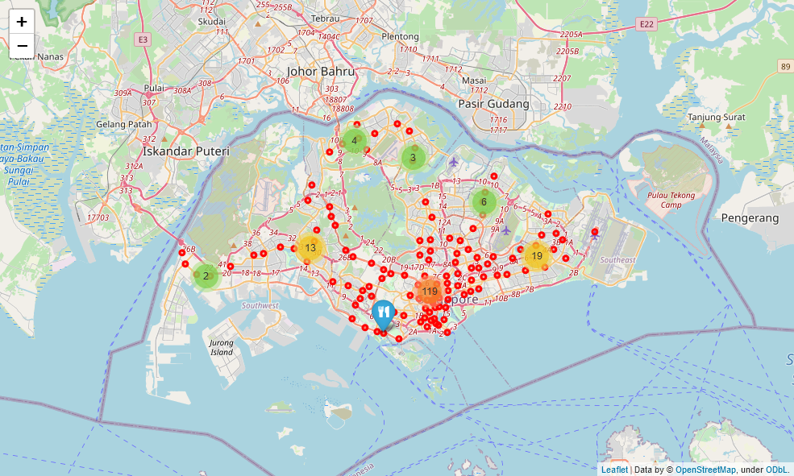

# Capstone Project - The Battle of Neighborhoods

*Kyle Bao | 10 June 2020 | IBM Applied Data Science Capstone Project*

## Introduction

Singapore is a multicultural city-state with a vibrant food scene. There are numerous restaurants serving cuisines from around the world, contributing to the city's high-quality diversified food scene. Due to the diversity of the food scene in Singapore, visitors may be spoilt for choices when deciding which eateries to visit. A map showing the distribution of high-quality restaurants and eateries in Singapore will be helpful in planning a culinary adventure through the city.

## Business Problem

- How can we provide a map showing the distribution of high-quality restaurants and eateries in Singapore?
- Can we facilitate the filtering and mapping of different types of eateries?

## Data

Instead of using data on the boundaries of neighborhoods in Singapore, we will use location data of the stations of the Mass Rapid Transit (MRT) train network. Not only does this serve as a proxy for neighborhoods, the resultant data product will also be more useful to a tourist visiting the city. Due to the cheap and efficient MRT train network, it is effortless for one to utilise the train network to plan one's itinerary and visit different parts of the city. Using the location data of the train stations, we will search for restaurants within walking distance of the station. The resultant map will be a map of high quality restaurants within walking distance of the train stations.

### Sources

Location data for the train stations are obtained from the following Wikipedia page:

- [List of Singapore MRT stations](https://en.wikipedia.org/wiki/List_of_Singapore_MRT_stations)

We will only use data for stations that are currently in operation.

The longitude and latitude coordinates for the stations will be obtained via the `Nominatim` geocoder for OpenStreetMap data from the `geopy` Python package.

The Foursquare API will be used to extract the list of restaurants around each station, as well as the restaurants' ratings and cuisine categories.

Finally, the map data used is provided by the `folium` package.

## Data Extraction and Cleaning

The raw list of Singapore MRT stations extracted from the Wikipedia page is messy and contains numerous irrelevant data such as subheadings, names of non-existing stations that are planned for future expansions, as well as duplicate entries. Consequently, I cleaned the data by firstly removing the subheadings. The data contains the opening dates of the stations. To drop all stations that are planned to be opened after 2020, I first have to extract the year from the date strings using regular expressions, convert them to numeric, and then simply apply a filter. Some station names contain translated names in Malay. These were also cleaned and only the English names of the stations remain.

Next, I used the `Nominatim` geocoder to obtain the latitude and longitude data for the individual stations.

To obtain the list of restaurants via the Foursquare API, the `?explore` endpoint was used. An additional parameter I included in the query is `&section=food`. Since we are only interested in restaurants and eateries, this additional parameter will ensure that all the reported venues from the API are eateries. This allows me to maximise the usage of valuable limited API calls. Additional details on the `section` parameter can be found on the [official API documentations](https://developer.foursquare.com/docs/api-reference/venues/explore/#parameters). The API also returns the detailed venue category of each venue, as well as its latitude and longitude.

## Data Exploration

Several stations have more restaurants and eateries within a 500m radius.

<table border="1" class="dataframe">
  <thead>
    <tr style="text-align: right;">
      <th>Station Name</th>
      <th>Venue</th>
    </tr>
  </thead>
  <tbody>
    <tr>
      <th>Admiralty</th>
      <td>9</td>
    </tr>
    <tr>
      <th>Aljunied</th>
      <td>38</td>
    </tr>
    <tr>
      <th>Ang Mo Kio</th>
      <td>39</td>
    </tr>
    <tr>
      <th>Bartley</th>
      <td>8</td>
    </tr>
    <tr>
      <th>Bayfront</th>
      <td>34</td>
    </tr>
    <tr>
      <th>Beauty World</th>
      <td>77</td>
    </tr>
    <tr>
      <th>Bedok</th>
      <td>57</td>
    </tr>
    <tr>
      <th>Bedok North</th>
      <td>12</td>
    </tr>
    <tr>
      <th>Bedok Reservoir</th>
      <td>4</td>
    </tr>
    <tr>
      <th>Bencoolen</th>
      <td>53</td>
    </tr>
    <tr>
      <th>Bendemeer</th>
      <td>22</td>
    </tr>
    <tr>
      <th>Bishan</th>
      <td>30</td>
    </tr>
    <tr>
      <th>Boon Keng</th>
      <td>21</td>
    </tr>
    <tr>
      <th>Boon Lay</th>
      <td>69</td>
    </tr>
    <tr>
      <th>Botanic Gardens</th>
      <td>32</td>
    </tr>
    <tr>
      <th>Braddell</th>
      <td>42</td>
    </tr>
    <tr>
      <th>Bras Basah</th>
      <td>69</td>
    </tr>
    <tr>
      <th>Buangkok</th>
      <td>21</td>
    </tr>
    <tr>
      <th>Bugis</th>
      <td>100</td>
    </tr>
    <tr>
      <th>Bukit Batok</th>
      <td>19</td>
    </tr>
    <tr>
      <th>Bukit Gombak</th>
      <td>21</td>
    </tr>
    <tr>
      <th>Bukit Panjang</th>
      <td>54</td>
    </tr>
    <tr>
      <th>Buona Vista</th>
      <td>45</td>
    </tr>
    <tr>
      <th>Caldecott</th>
      <td>4</td>
    </tr>
    <tr>
      <th>Canberra</th>
      <td>4</td>
    </tr>
    <tr>
      <th>Cashew</th>
      <td>6</td>
    </tr>
    <tr>
      <th>Changi Airport</th>
      <td>43</td>
    </tr>
    <tr>
      <th>Chinatown</th>
      <td>100</td>
    </tr>
    <tr>
      <th>Chinese Garden</th>
      <td>11</td>
    </tr>
    <tr>
      <th>Choa Chu Kang</th>
      <td>31</td>
    </tr>
    <tr>
      <th>City Hall</th>
      <td>53</td>
    </tr>
    <tr>
      <th>Clarke Quay</th>
      <td>100</td>
    </tr>
    <tr>
      <th>Clementi</th>
      <td>59</td>
    </tr>
    <tr>
      <th>Commonwealth</th>
      <td>38</td>
    </tr>
    <tr>
      <th>Dakota</th>
      <td>25</td>
    </tr>
    <tr>
      <th>Dhoby Ghaut</th>
      <td>57</td>
    </tr>
    <tr>
      <th>Dover</th>
      <td>16</td>
    </tr>
    <tr>
      <th>Downtown</th>
      <td>77</td>
    </tr>
    <tr>
      <th>Esplanade</th>
      <td>100</td>
    </tr>
    <tr>
      <th>Eunos</th>
      <td>19</td>
    </tr>
    <tr>
      <th>Expo</th>
      <td>73</td>
    </tr>
    <tr>
      <th>Farrer Park</th>
      <td>51</td>
    </tr>
    <tr>
      <th>Farrer Road</th>
      <td>13</td>
    </tr>
    <tr>
      <th>Fort Canning</th>
      <td>100</td>
    </tr>
    <tr>
      <th>Geylang Bahru</th>
      <td>8</td>
    </tr>
    <tr>
      <th>Gul Circle</th>
      <td>6</td>
    </tr>
    <tr>
      <th>HarbourFront</th>
      <td>100</td>
    </tr>
    <tr>
      <th>Haw Par Villa</th>
      <td>8</td>
    </tr>
    <tr>
      <th>Hillview</th>
      <td>25</td>
    </tr>
    <tr>
      <th>Holland Village</th>
      <td>46</td>
    </tr>
    <tr>
      <th>Hougang</th>
      <td>32</td>
    </tr>
    <tr>
      <th>Jalan Besar</th>
      <td>41</td>
    </tr>
    <tr>
      <th>Joo Koon</th>
      <td>16</td>
    </tr>
    <tr>
      <th>Jurong East</th>
      <td>64</td>
    </tr>
    <tr>
      <th>Kaki Bukit</th>
      <td>24</td>
    </tr>
    <tr>
      <th>Kallang</th>
      <td>16</td>
    </tr>
    <tr>
      <th>Kembangan</th>
      <td>34</td>
    </tr>
    <tr>
      <th>Kent Ridge</th>
      <td>30</td>
    </tr>
    <tr>
      <th>Khatib</th>
      <td>20</td>
    </tr>
    <tr>
      <th>King Albert Park</th>
      <td>11</td>
    </tr>
    <tr>
      <th>Kovan</th>
      <td>42</td>
    </tr>
    <tr>
      <th>Kranji</th>
      <td>5</td>
    </tr>
    <tr>
      <th>Labrador Park</th>
      <td>21</td>
    </tr>
    <tr>
      <th>Lakeside</th>
      <td>10</td>
    </tr>
    <tr>
      <th>Lavender</th>
      <td>70</td>
    </tr>
    <tr>
      <th>Little India</th>
      <td>34</td>
    </tr>
    <tr>
      <th>Lorong Chuan</th>
      <td>11</td>
    </tr>
    <tr>
      <th>MacPherson</th>
      <td>35</td>
    </tr>
    <tr>
      <th>Marina Bay</th>
      <td>49</td>
    </tr>
    <tr>
      <th>Marina South Pier</th>
      <td>5</td>
    </tr>
    <tr>
      <th>Marsiling</th>
      <td>27</td>
    </tr>
    <tr>
      <th>Marymount</th>
      <td>11</td>
    </tr>
    <tr>
      <th>Mattar</th>
      <td>27</td>
    </tr>
    <tr>
      <th>Mountbatten</th>
      <td>54</td>
    </tr>
    <tr>
      <th>Newton</th>
      <td>20</td>
    </tr>
    <tr>
      <th>Nicoll Highway</th>
      <td>27</td>
    </tr>
    <tr>
      <th>Novena</th>
      <td>80</td>
    </tr>
    <tr>
      <th>Orchard</th>
      <td>100</td>
    </tr>
    <tr>
      <th>Outram Park</th>
      <td>61</td>
    </tr>
    <tr>
      <th>Pasir Panjang</th>
      <td>23</td>
    </tr>
    <tr>
      <th>Pasir Ris</th>
      <td>38</td>
    </tr>
    <tr>
      <th>Paya Lebar</th>
      <td>73</td>
    </tr>
    <tr>
      <th>Pioneer</th>
      <td>7</td>
    </tr>
    <tr>
      <th>Potong Pasir</th>
      <td>44</td>
    </tr>
    <tr>
      <th>Promenade</th>
      <td>43</td>
    </tr>
    <tr>
      <th>Punggol</th>
      <td>62</td>
    </tr>
    <tr>
      <th>Queenstown</th>
      <td>20</td>
    </tr>
    <tr>
      <th>Raffles Place</th>
      <td>39</td>
    </tr>
    <tr>
      <th>Redhill</th>
      <td>28</td>
    </tr>
    <tr>
      <th>Rochor</th>
      <td>35</td>
    </tr>
    <tr>
      <th>Sembawang</th>
      <td>33</td>
    </tr>
    <tr>
      <th>Sengkang</th>
      <td>35</td>
    </tr>
    <tr>
      <th>Serangoon</th>
      <td>36</td>
    </tr>
    <tr>
      <th>Simei</th>
      <td>22</td>
    </tr>
    <tr>
      <th>Sixth Avenue</th>
      <td>26</td>
    </tr>
    <tr>
      <th>Somerset</th>
      <td>42</td>
    </tr>
    <tr>
      <th>Stadium</th>
      <td>28</td>
    </tr>
    <tr>
      <th>Stevens</th>
      <td>11</td>
    </tr>
    <tr>
      <th>Tai Seng</th>
      <td>61</td>
    </tr>
    <tr>
      <th>Tampines</th>
      <td>77</td>
    </tr>
    <tr>
      <th>Tampines East</th>
      <td>16</td>
    </tr>
    <tr>
      <th>Tampines West</th>
      <td>18</td>
    </tr>
    <tr>
      <th>Tan Kah Kee</th>
      <td>13</td>
    </tr>
    <tr>
      <th>Tanah Merah</th>
      <td>4</td>
    </tr>
    <tr>
      <th>Tanjong Pagar</th>
      <td>100</td>
    </tr>
    <tr>
      <th>Telok Ayer</th>
      <td>84</td>
    </tr>
    <tr>
      <th>Telok Blangah</th>
      <td>21</td>
    </tr>
    <tr>
      <th>Tiong Bahru</th>
      <td>30</td>
    </tr>
    <tr>
      <th>Toa Payoh</th>
      <td>35</td>
    </tr>
    <tr>
      <th>Tuas Crescent</th>
      <td>3</td>
    </tr>
    <tr>
      <th>Tuas Link</th>
      <td>3</td>
    </tr>
    <tr>
      <th>Tuas West Road</th>
      <td>4</td>
    </tr>
    <tr>
      <th>Ubi</th>
      <td>12</td>
    </tr>
    <tr>
      <th>Upper Changi</th>
      <td>11</td>
    </tr>
    <tr>
      <th>Woodlands</th>
      <td>57</td>
    </tr>
    <tr>
      <th>Woodlands North</th>
      <td>5</td>
    </tr>
    <tr>
      <th>Woodlands South</th>
      <td>11</td>
    </tr>
    <tr>
      <th>Woodleigh</th>
      <td>5</td>
    </tr>
    <tr>
      <th>Yew Tee</th>
      <td>12</td>
    </tr>
    <tr>
      <th>Yio Chu Kang</th>
      <td>17</td>
    </tr>
    <tr>
      <th>Yishun</th>
      <td>41</td>
    </tr>
    <tr>
      <th>one-north</th>
      <td>45</td>
    </tr>
  </tbody>
</table>

We can also list all the 106 different categories of restaurants and eateries in the data extracted from Foursquare.

    106 F&B categories.
    ['Chinese Restaurant' 'Bakery' 'Japanese Restaurant'
     'Vegetarian / Vegan Restaurant' 'Indian Restaurant' 'Burger Joint'
     'Seafood Restaurant' 'Korean Restaurant' 'German Restaurant'
     'Hotpot Restaurant' 'Italian Restaurant' 'Ramen Restaurant' 'Salad Place'
     'Café' 'Dumpling Restaurant' 'Sushi Restaurant' 'Halal Restaurant'
     'Asian Restaurant' 'Food Court' 'Cafeteria' 'Sandwich Place'
     'Fast Food Restaurant' 'Steakhouse' 'Dim Sum Restaurant' 'Soup Place'
     'Diner' 'Japanese Curry Restaurant' 'Bistro' 'American Restaurant'
     'Indonesian Restaurant' 'Buffet' 'Malay Restaurant' 'Pizza Place'
     'BBQ Joint' 'Restaurant' 'Portuguese Restaurant' 'Thai Restaurant'
     'Noodle House' 'Food Truck' 'Comfort Food Restaurant' 'Hainan Restaurant'
     'Fried Chicken Joint' 'Snack Place' 'Breakfast Spot' 'Food'
     'Hong Kong Restaurant' 'Wings Joint' 'Mexican Restaurant'
     'Middle Eastern Restaurant' 'Modern European Restaurant'
     'Shaanxi Restaurant' 'Hakka Restaurant' 'Gastropub'
     'Chinese Breakfast Place' 'Bagel Shop' 'Food Stand'
     'Vietnamese Restaurant' 'Cantonese Restaurant' 'Donut Shop'
     'French Restaurant' 'Peking Duck Restaurant' 'Spanish Restaurant'
     'Shabu-Shabu Restaurant' 'Filipino Restaurant' 'Mediterranean Restaurant'
     'Soba Restaurant' 'Swiss Restaurant' 'Deli / Bodega' 'Fish & Chips Shop'
     'Creperie' 'Molecular Gastronomy Restaurant' 'Fujian Restaurant'
     'Burmese Restaurant' 'Argentinian Restaurant' 'Poke Place'
     'Hot Dog Joint' 'Burrito Place' 'Theme Restaurant' 'African Restaurant'
     'Taiwanese Restaurant' 'Pet Café' 'Peruvian Restaurant'
     'Kebab Restaurant' 'Tapas Restaurant' 'Southern / Soul Food Restaurant'
     'Austrian Restaurant' 'Australian Restaurant' 'South Indian Restaurant'
     'Cha Chaan Teng' 'New American Restaurant' 'Beijing Restaurant'
     'Yunnan Restaurant' 'Dongbei Restaurant' 'Greek Restaurant'
     'Szechuan Restaurant' 'Manchu Restaurant' 'Cuban Restaurant'
     'Persian Restaurant' 'North Indian Restaurant' 'Macanese Restaurant'
     'Turkish Restaurant' 'Taco Place' 'Satay Restaurant' 'English Restaurant'
     'Churrascaria' 'Eastern European Restaurant']
    

## Analysing the Eateries and Restaurants Around Each Station

### Most Common Restaurant/Eatery

I analysed the list of venues within 500m of a station, and collated them according to their venue category. This way, I can figure out what are the top few types of restaurants/eateries for each station.

<table border="1" class="dataframe">
  <thead>
    <tr style="text-align: right;">
      <th></th>
      <th>Station Name</th>
      <th>1st Most Common Venue</th>
      <th>2nd Most Common Venue</th>
      <th>3rd Most Common Venue</th>
      <th>4th Most Common Venue</th>
      <th>5th Most Common Venue</th>
      <th>6th Most Common Venue</th>
      <th>7th Most Common Venue</th>
      <th>8th Most Common Venue</th>
      <th>9th Most Common Venue</th>
      <th>10th Most Common Venue</th>
    </tr>
  </thead>
  <tbody>
    <tr>
      <th>0</th>
      <td>Admiralty</td>
      <td>Bakery</td>
      <td>Food Court</td>
      <td>Burger Joint</td>
      <td>Seafood Restaurant</td>
      <td>Noodle House</td>
      <td>Snack Place</td>
      <td>Fish &amp; Chips Shop</td>
      <td>Diner</td>
      <td>Dongbei Restaurant</td>
      <td>Donut Shop</td>
    </tr>
    <tr>
      <th>1</th>
      <td>Aljunied</td>
      <td>Noodle House</td>
      <td>Chinese Restaurant</td>
      <td>Vegetarian / Vegan Restaurant</td>
      <td>Asian Restaurant</td>
      <td>Food Court</td>
      <td>Café</td>
      <td>Breakfast Spot</td>
      <td>Dim Sum Restaurant</td>
      <td>Seafood Restaurant</td>
      <td>Indian Restaurant</td>
    </tr>
    <tr>
      <th>2</th>
      <td>Ang Mo Kio</td>
      <td>Food Court</td>
      <td>Fast Food Restaurant</td>
      <td>Japanese Restaurant</td>
      <td>Sushi Restaurant</td>
      <td>Chinese Restaurant</td>
      <td>Asian Restaurant</td>
      <td>Sandwich Place</td>
      <td>Snack Place</td>
      <td>Breakfast Spot</td>
      <td>Burger Joint</td>
    </tr>
    <tr>
      <th>3</th>
      <td>Bartley</td>
      <td>Noodle House</td>
      <td>Indian Restaurant</td>
      <td>Asian Restaurant</td>
      <td>Seafood Restaurant</td>
      <td>Korean Restaurant</td>
      <td>Food Truck</td>
      <td>Café</td>
      <td>Yunnan Restaurant</td>
      <td>Fish &amp; Chips Shop</td>
      <td>Dongbei Restaurant</td>
    </tr>
    <tr>
      <th>4</th>
      <td>Bayfront</td>
      <td>Café</td>
      <td>Bistro</td>
      <td>Japanese Restaurant</td>
      <td>Italian Restaurant</td>
      <td>Chinese Restaurant</td>
      <td>Noodle House</td>
      <td>Asian Restaurant</td>
      <td>Southern / Soul Food Restaurant</td>
      <td>Dumpling Restaurant</td>
      <td>Cantonese Restaurant</td>
    </tr>
  </tbody>
</table>

### K Means Clustering

By using K Means Clustering, I clustered all the stations into 10 different groups, depending on their similarity of each station's top 10 restaurants/eatery categories. The following map shows the visulised clusters according to the colours.

## Mapping Out all Restaurants of a Certain Category

One of the goals of this project is to provide entrepreneurs a easy-to-use map visualisation of all the restaurants in the City. From our earlier data extraction, we already have a comprehensive data set of the restaurants and eateries within a 500m radius of all the MRT stations in Singapore.

An entrepreneur may wish to open a restaurant serving a certain type of cuisine, and may wish to know the concentration of similar restaurants/eateries in the City. Hence, I wrote a function which can be easily called with the right parameters to map out similar restaurants.

The map also displays the MRT stations as red circles, and the eateries as either blue circles in the non-clustered map, or as popup markers in the clustered version.

Let us see it in action.

### Indian Restaurants

#### Map with No Clustering

#### Map with Clustering

Interestingly, there seems to be very little Indian restaurants near the MRT stations in the heartland estates in the North, the Northeast, and also all the way to the West. Unsurprisingly, there is a large congregation of Indian restaurants around the Little India MRT Station.

### Mexican Restaurants

#### Map with No Clustering

#### Map with Clustering

There are very few Mexican restuarants that are within 500m radius of a MRT train station. In fact, as seen from the map, our dataset shows that there are only 28 such restaurants. If demand can be ascertained, opening a Mexican restaurant can be venture to be considered.

## Conclusions

There are numerous restaurants and eateries in Singapore serving all kinds of cuisines. However, as this analysis and visualisation has shown, the distribution of such eateries is not even. Furthermore, some cuisines have fewer restaurants, providing opportunity for new businesses. I hope that the tool in the accompaning notebook will help people in answering this business decision.

Further extensions include using a Premium Foursquare API to extract the ratings for all the restaurants in our dataset. This was not attempted in this exercise due to the prohibitive pricing.